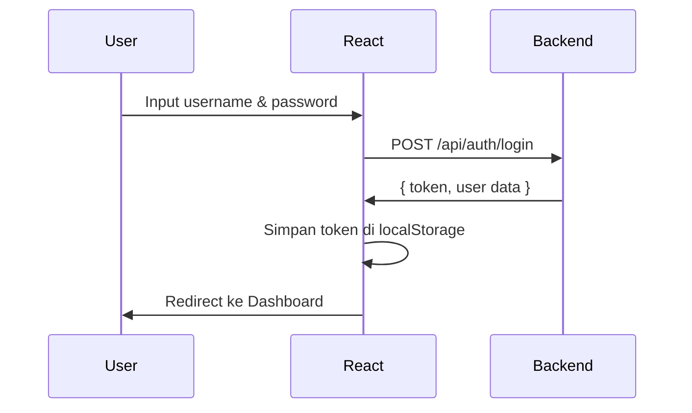
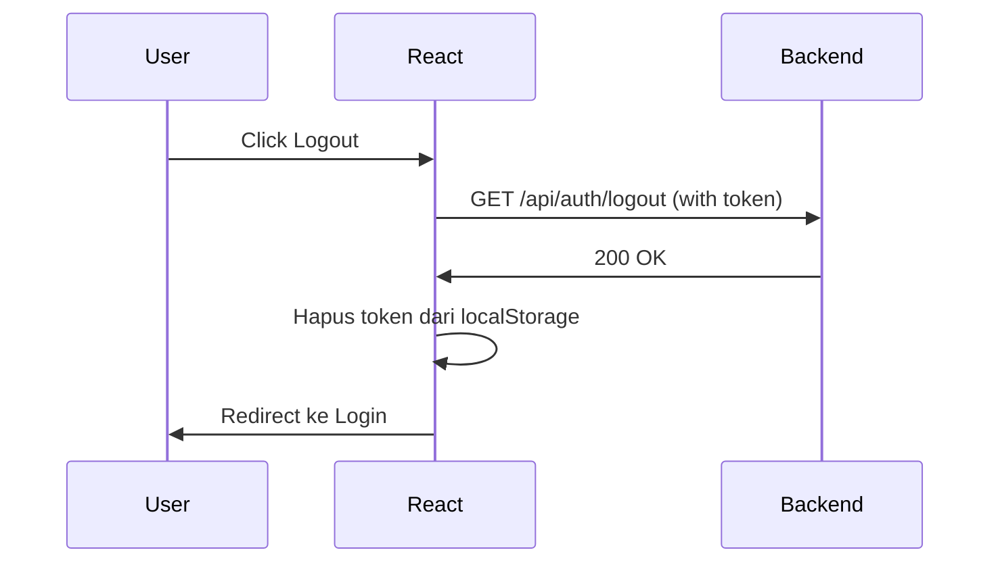

# Frontend Integration Guide

Panduan integrasi Backend Library Management System dengan Frontend React JS.

## Daftar Isi
- [CORS Configuration](#cors-configuration)
- [Setup React Project](#setup-react-project)
- [API Integration](#api-integration)
- [Authentication Flow](#authentication-flow)
- [Contoh Implementasi](#contoh-implementasi)

---

## CORS Configuration

Backend sudah dikonfigurasi untuk mengizinkan request dari origin berikut:

```yaml
# application.yml
app:
  cors:
    allowed-origins:
      - http://localhost:3000  # Create React App
      - http://localhost:5173  # Vite
      - http://localhost:8000  # Custom port
```

### Menambahkan Origin Baru

Jika frontend Anda berjalan di port lain, tambahkan origin di `application.yml`:

```yaml
app:
  cors:
    allowed-origins: http://localhost:3000,http://localhost:5173,http://localhost:YOUR_PORT
```

---

## Setup React Project

### 1. Buat Project Baru (Vite)

```bash
npm create vite@latest library-frontend -- --template react
cd library-frontend
npm install
```

### 2. Install Dependencies

```bash
# Untuk HTTP requests
npm install axios

# Untuk routing (opsional)
npm install react-router-dom

# Untuk state management (opsional)
npm install zustand joti

# Untuk UI components (opsional)
npm install @mui/material @emotion/react @emotion/styled
```

---

## API Integration

### 1. Buat File Konfigurasi API

Buat file `src/api/index.js`:

```javascript
import axios from 'axios';

const API_BASE_URL = 'http://localhost:8080/api';

const api = axios.create({
  baseURL: API_BASE_URL,
  headers: {
    'Content-Type': 'application/json',
  },
});

// Request Interceptor - Tambahkan token
api.interceptors.request.use(
  (config) => {
    const token = localStorage.getItem('token');
    if (token) {
      config.headers.Authorization = `Bearer ${token}`;
    }
    return config;
  },
  (error) => Promise.reject(error)
);

// Response Interceptor - Handle error
api.interceptors.response.use(
  (response) => response.data,
  (error) => {
    if (error.response?.status === 401) {
      localStorage.removeItem('token');
      window.location.href = '/login';
    }
    return Promise.reject(error.response?.data);
  }
);

export default api;
```

### 2. Buat API Services

Buat file `src/api/auth.js`:

```javascript
import api from './index';

export const authService = {
  login: (username, password) =>
    api.post('/auth/login', { username, password }),

  register: (data) =>
    api.post('/auth/register', data),

  registerAdmin: (data) =>
    api.post('/auth/register/admin', data),

  logout: () =>
    api.get('/auth/logout'),
};
```

---

## Authentication Flow

### Login Flow



### Logout Flow



---

## Contoh Implementasi

### 1. Login Component

```jsx
import { useState } from 'react';
import { authService } from '../api/auth';
import { useNavigate } from 'react-router-dom';

function LoginForm() {
  const [formData, setFormData] = useState({
    username: '',
    password: '',
  });
  const [error, setError] = useState('');
  const navigate = useNavigate();

  const handleChange = (e) => {
    setFormData({
      ...formData,
      [e.target.name]: e.target.value,
    });
  };

  const handleSubmit = async (e) => {
    e.preventDefault();
    setError('');

    try {
      const response = await authService.login(
        formData.username,
        formData.password
      );

      // Simpan token dan user data
      localStorage.setItem('token', response.data.token);
      localStorage.setItem('user', JSON.stringify(response.data));

      // Redirect ke dashboard
      navigate('/dashboard');
    } catch (err) {
      setError(err.message || 'Login gagal');
    }
  };

  return (
    <form onSubmit={handleSubmit}>
      <h2>Login</h2>

      {error && <div className="error">{error}</div>}

      <input
        type="text"
        name="username"
        placeholder="Username"
        value={formData.username}
        onChange={handleChange}
        required
      />

      <input
        type="password"
        name="password"
        placeholder="Password"
        value={formData.password}
        onChange={handleChange}
        required
      />

      <button type="submit">Login</button>
    </form>
  );
}

export default LoginForm;
```

### 2. Protected Route Component

```jsx
import { useEffect, useState } from 'react';
import { Navigate } from 'react-router-dom';
import api from '../api';

function ProtectedRoute({ children }) {
  const [loading, setLoading] = useState(true);
  const [authenticated, setAuthenticated] = useState(false);

  useEffect(() => {
    const checkAuth = async () => {
      const token = localStorage.getItem('token');

      if (!token) {
        setLoading(false);
        return;
      }

      try {
        // Verifikasi token dengan request ke backend
        await api.get('/auth/verify');
        setAuthenticated(true);
      } catch (err) {
        localStorage.removeItem('token');
        setAuthenticated(false);
      } finally {
        setLoading(false);
      }
    };

    checkAuth();
  }, []);

  if (loading) {
    return <div>Loading...</div>;
  }

  if (!authenticated) {
    return <Navigate to="/login" replace />;
  }

  return children;
}

export default ProtectedRoute;
```

### 3. Logout Component

```jsx
import { useNavigate } from 'react-router-dom';
import { authService } from '../api/auth';

function LogoutButton() {
  const navigate = useNavigate();

  const handleLogout = async () => {
    try {
      await authService.logout();
    } catch (err) {
      console.error('Logout error:', err);
    } finally {
      // Hapus data lokal
      localStorage.removeItem('token');
      localStorage.removeItem('user');
      navigate('/login');
    }
  };

  return <button onClick={handleLogout}>Logout</button>;
}

export default LogoutButton;
```

### 4. App Routing

```jsx
import { BrowserRouter, Routes, Route, Navigate } from 'react-router-dom';
import LoginForm from './components/LoginForm';
import Dashboard from './components/Dashboard';
import ProtectedRoute from './components/ProtectedRoute';
import LogoutButton from './components/LogoutButton';

function App() {
  return (
    <BrowserRouter>
      <Routes>
        <Route path="/login" element={<LoginForm />} />

        <Route
          path="/dashboard"
          element={
            <ProtectedRoute>
              <Dashboard />
            </ProtectedRoute>
          }
        />

        <Route path="/" element={<Navigate to="/dashboard" replace />} />
      </Routes>
    </BrowserRouter>
  );
}

export default App;
```

---

## API Endpoints

### Auth Endpoints

| Method | Endpoint | Deskripsi | Auth Required |
|--------|----------|-----------|---------------|
| POST | `/api/auth/login` | Login user & admin | No |
| POST | `/api/auth/register` | Register mahasiswa | No |
| POST | `/api/auth/register/admin` | Register admin | No |
| GET | `/api/auth/logout` | Logout user | Yes |

### Response Format

**Success Response:**
```json
{
  "status": 200,
  "success": true,
  "message": "Berhasil Login",
  "data": {
    "token": "eyJhbGciOiJIUzI1NiJ9...",
    "id": "uuid",
    "username": "admin",
    "email": "admin@library.com",
    "nama": "Administrator",
    "role": "ADMIN"
  }
}
```

**Error Response:**
```json
{
  "status": 401,
  "success": false,
  "message": "Unauthorized access, please login first",
  "data": null
}
```

---

## Troubleshooting

### CORS Error

Jika masih mendapatkan error CORS:

1. **Pastikan backend berjalan** di port 8080
2. **Cek origin di application.yml** sesuai dengan port frontend
3. **Restart backend** setelah mengubah konfigurasi CORS
4. **Clear browser cache** atau gunakan incognito mode

### Token Expired

Token expired setelah 1 jam. Handle dengan:

```javascript
api.interceptors.response.use(
  (response) => response.data,
  (error) => {
    if (error.response?.status === 401) {
      // Token expired atau invalid
      localStorage.removeItem('token');
      window.location.href = '/login';
    }
    return Promise.reject(error);
  }
);
```

---

## Support

Untuk pertanyaan atau masalah, hubungi tim development.
